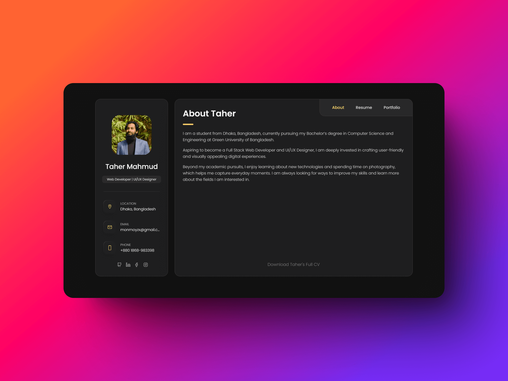
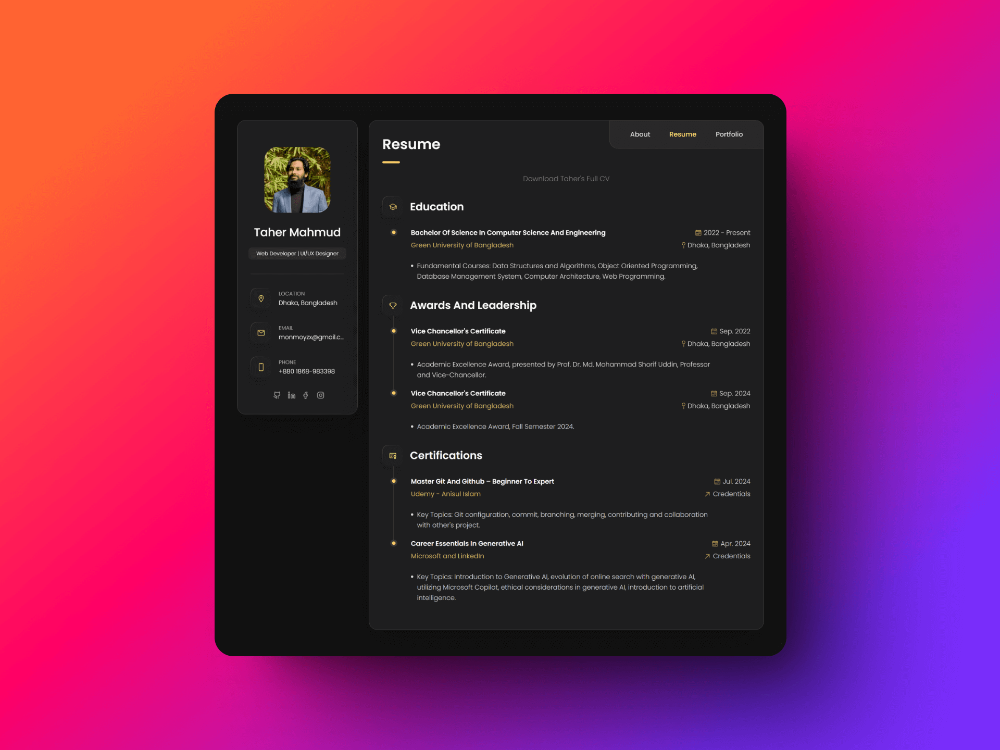
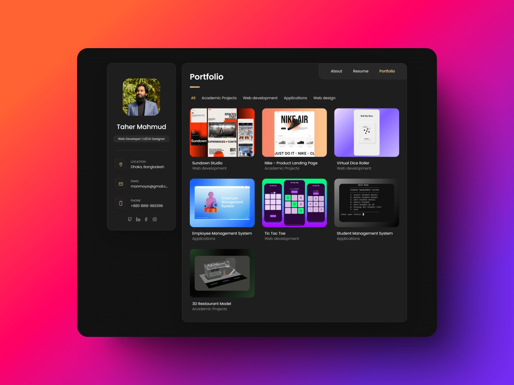
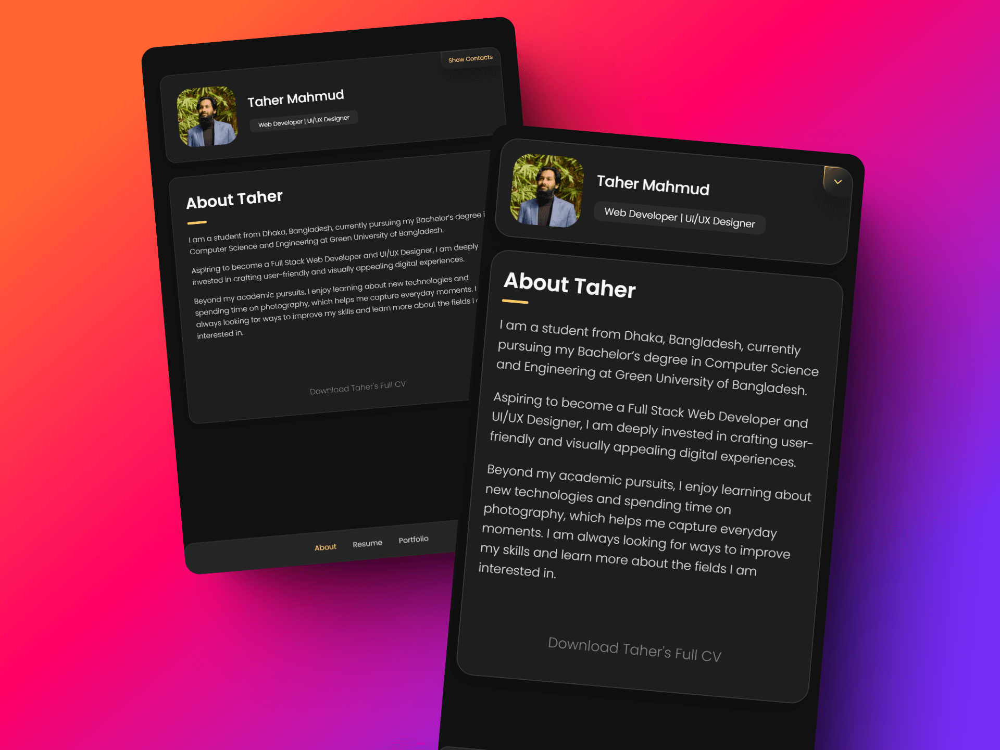
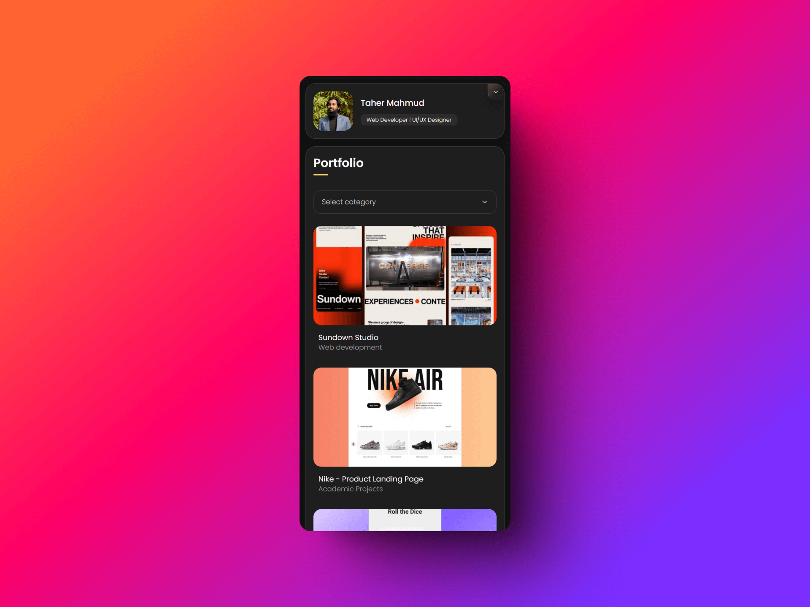

<a name="readme-top"></a>

# Taher Portfolio Website - React ✨

Live Website: [https://taher-portfolio.pages.dev](https://taher-portfolio.pages.dev)

## 📷 Preview







- Minimal design with subtle animations.
- Migrated from vanilla JS to **React + Vite** for a component-based architecture.
- Showcase resume and portfolio.

## 🔧 Tech Stack

- **React** — UI components
- **Vite** — build tooling and dev server
- **CSS** — custom properties, no framework

## 🛠️ Setup Instructions

1. **Clone the Repository**:

   ```bash
   git clone https://github.com/taher-dev/taher-portfolio.git
   cd taher-portfolio
   ```

2. **Install Dependencies**:

   ```bash
   npm install
   ```

3. **Start the Dev Server**:

   ```bash
   npm run dev
   ```

4. **Build for Production**:

   ```bash
   npm run build
   ```

## 📂 Project Structure

```
taher-portfolio/
├── public/
│   └── assets/
│       └── docs/
│           └── Taher_Mahmud_Monmoy_Public_CV.pdf   # stable URL, linked directly in JSX
├── src/
│   ├── assets/
│   │   ├── css/
│   │   │   └── style.css
│   │   └── images/                                  # imported in components via JS
│   │       ├── projects/
│   │       └── readme/
│   ├── components/
│   │   ├── Modal/
│   │   │   └── ProfileModal.jsx
│   │   ├── Navbar/
│   │   │   └── Navbar.jsx
│   │   ├── pages/
│   │   │   ├── About.jsx
│   │   │   ├── Portfolio.jsx
│   │   │   └── Resume.jsx
│   │   └── Sidebar/
│   │       └── Sidebar.jsx
│   ├── data/
│   │   └── projects.js
│   ├── App.jsx
│   └── main.jsx
├── index.html
└── vite.config.js
```

## 📲 Contact Info

> **Taher Mahmud Monmoy**
>
> <aside>
>   📩 E-mail: <a href="mailto:monmoyzx@gmail.com">monmoyzx@gmail.com</a>
> <br>
>   🧳 LinkedIn: <a href="https://www.linkedin.com/in/taher-mahmud-monmoy/">Taher Mahmud Monmoy</a>
> <br>
>   👨🏻‍💻 GitHub: <a href="https://github.com/taher-dev">taher-dev</a>
> </aside>

---

A fully responsive, mobile-first portfolio website, inspired by [codewithsadee/vcard-personal-portfolio](https://github.com/codewithsadee/vcard-personal-portfolio).

<p align="right" style="font-size: 14px; color: #555; margin-top: 20px;">
    <a href="#readme-top" style="text-decoration: none; color: #007bff; font-weight: bold;">
        ↑ Back to Top ↑
    </a>
</p>
